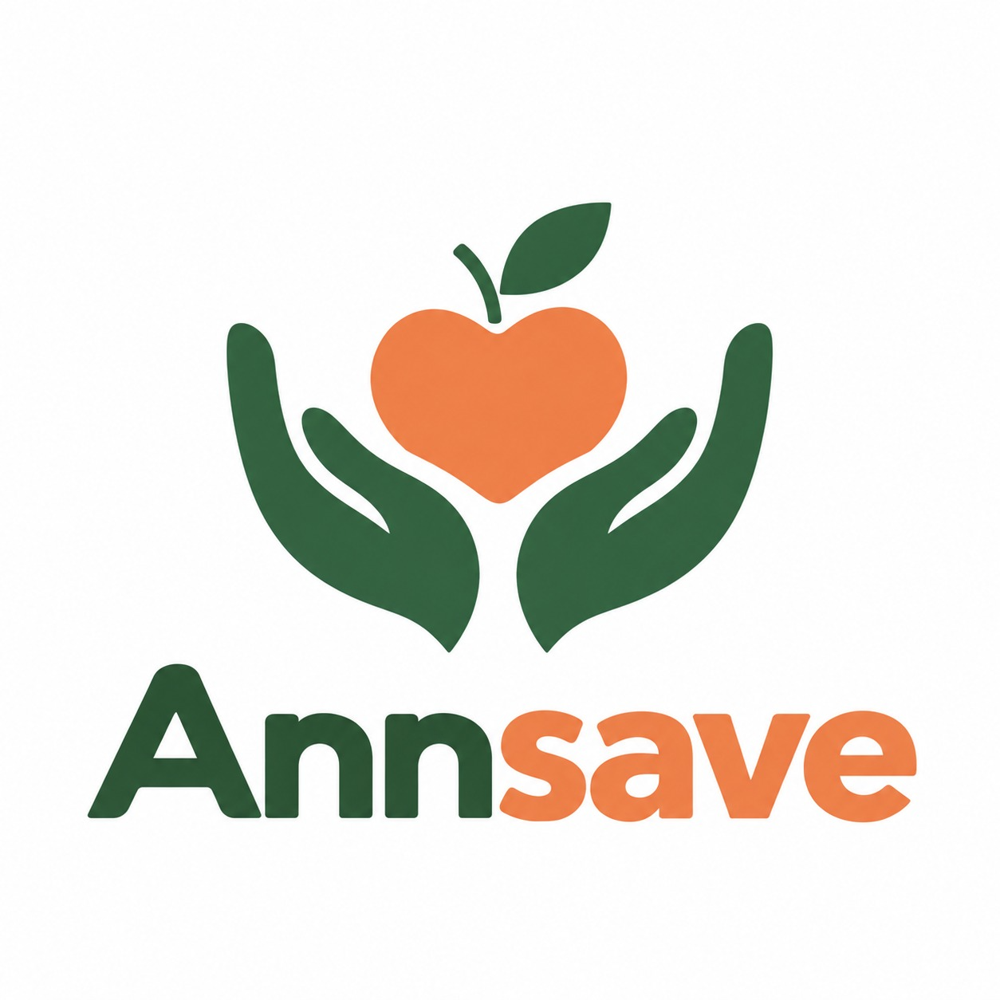
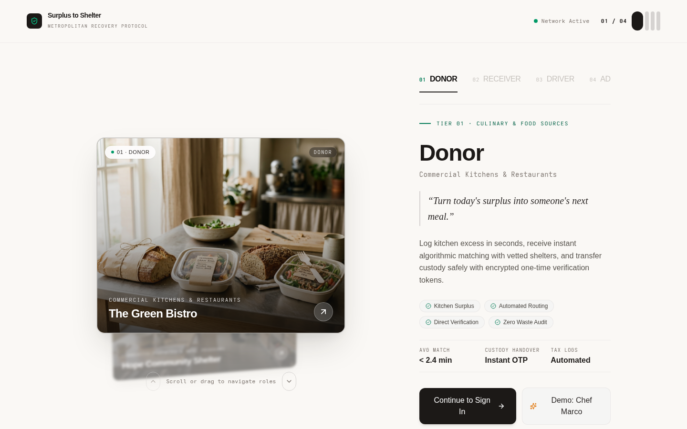
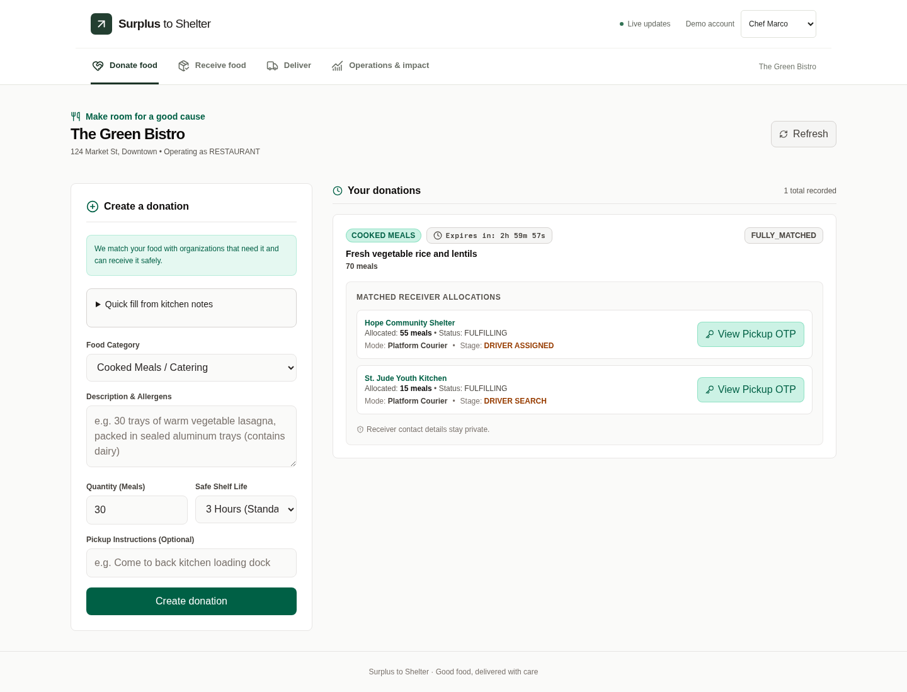
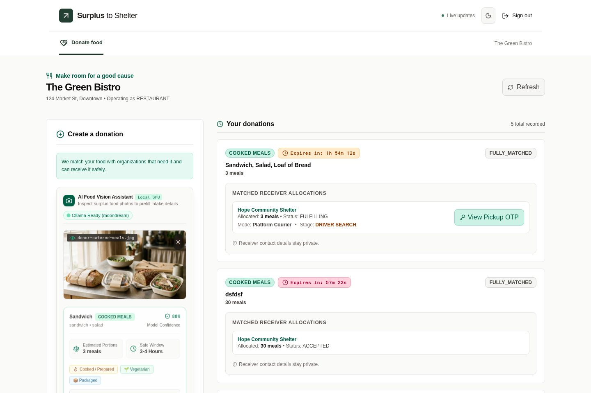
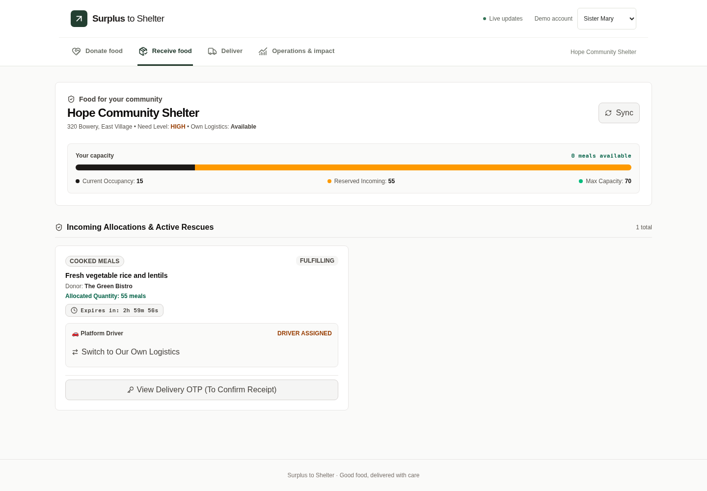
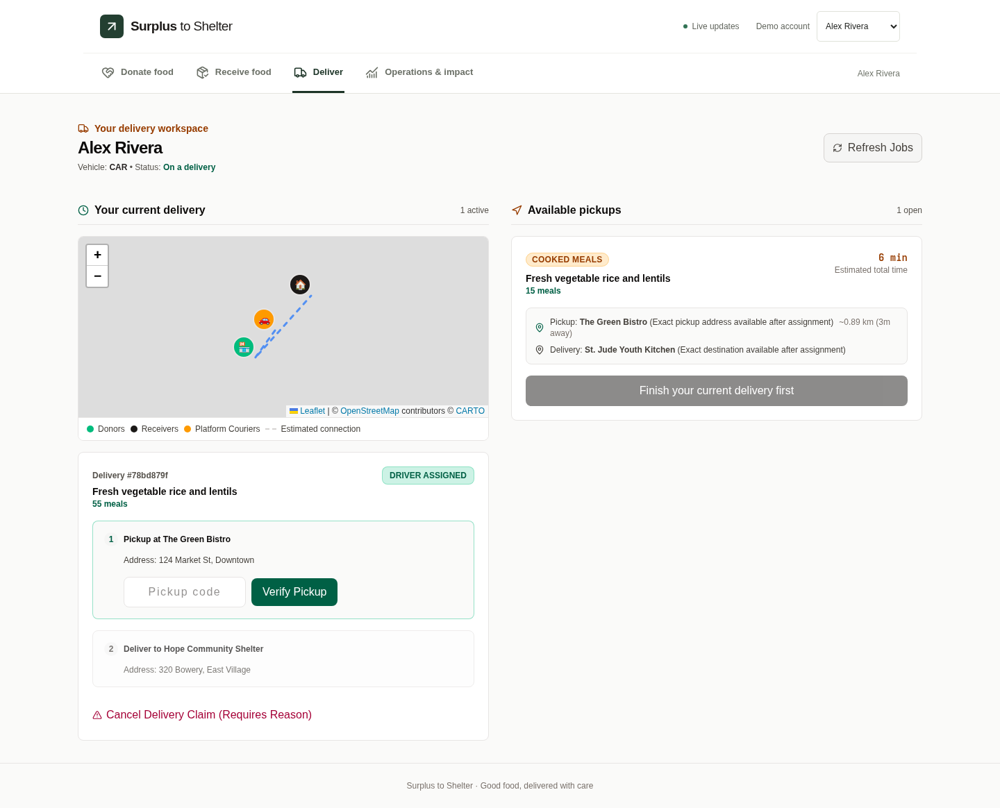
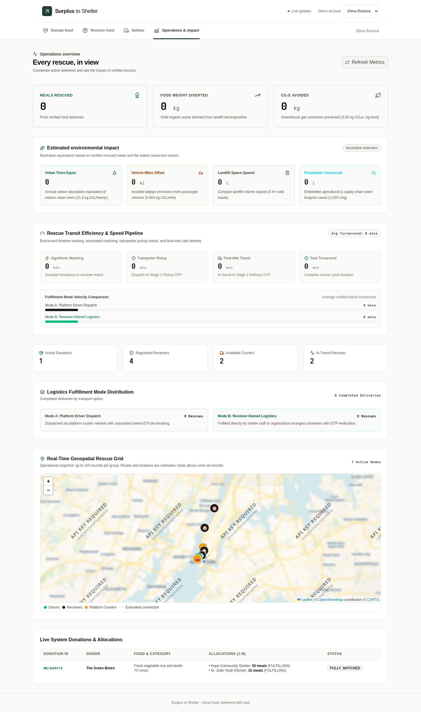
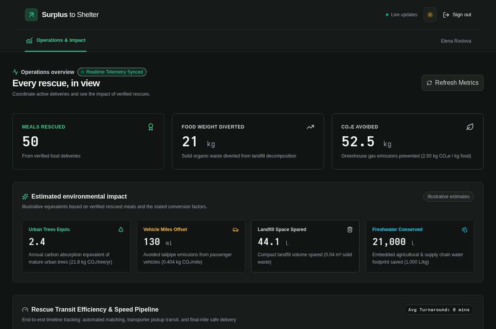

<p align="center">
  
</p>

<h1 align="center">Annsave</h1>

<p align="center">
  <strong>Real-Time Food Rescue, Intelligent Routing & Surplus Redistribution Platform</strong>
</p>

<p align="center">
  <a href="https://annsave.vercel.app"></a>
  
  
  
  
  
</p>

---

## 📌 Overview

**Annsave** is a real-time food rescue platform that connects commercial food donors (restaurants, corporate cafeterias, supermarkets) with community shelters and hunger relief centers. It eliminates waste and feeds communities through automated intelligent matching, authoritative capacity controls, dual fulfillment logistics, and cryptographically verified custody transfers.

### ✨ Key Features

- **Editorial 3D Account Selector**: Fluid horizontal scroll-driven role discovery inspired by editorial design patterns.
- **Four Distinct Role Portals**: Dedicated workspaces for **Donors**, **Receivers**, **Drivers**, and **Admins**.
- **Dual Fulfillment Logistics**: Flexible fulfillment enabling either on-demand platform volunteer drivers or receiver-owned vehicle fleets.
- **Two-Stage Verified OTP Handshake**: Secure custody handoff with cryptographic 6-digit pickup and drop-off verification.
- **AI Food Vision Scanner**: Real-time visual food inspection using Google Gemini vision models to automatically detect food items, categorize dietary tags, and estimate shelf-life.
- **Google Address Descriptors**: Landmark-assisted pickup coordinates with high precision navigation.
- **Adaptive Dark Mode**: Comprehensive light and dark theme support tailored for all viewports and portals.

---

## 📸 Dashboards & Workspaces

### 1. Interactive Account Selection & Login
The entry point features an editorial spatial carousel with kinetic typography, active role emphasis, and responsive card micro-interactions.

<p align="center">
  
</p>

---

### 2. Donor Portal (Food Surplus Posting & Intake)
Donors create surplus food listings, manage pickup time windows, and use Google Gemini AI Food Vision to scan and prefill food descriptions and nutritional details.

<p align="center">
  
</p>

#### AI Food Vision Scanner & Address Landmarks
<p align="center">
  
</p>

---

### 3. Receiver Portal (Intake & Dual Fulfillment)
Shelters monitor incoming matches, manage real-time capacity and occupancy thresholds, set dietary intake filters, and select fulfillment logistics.

<p align="center">
  
</p>

---

### 4. Driver Portal (Live Dispatch & Verified Handshakes)
Drivers view open rescue missions, accept nearby pickup jobs, view interactive maps, and complete two-stage OTP handshakes.

<p align="center">
  
</p>

---

### 5. Admin Operations & Impact Command Center
Administrators monitor active deliveries across the city map, evaluate live capacity bottlenecks, inspect match allocations, and measure environmental diversion metrics (meals rescued, kg diverted, CO₂e avoided).

<p align="center">
  
</p>

#### Full Dark Mode Support
<p align="center">
  
</p>

---

## 👥 Demo Accounts

The project includes seeded accounts for each workspace. You can sign in using any of the following credentials:

| Role | Name / Organization | Email | Default Password |
| :--- | :--- | :--- | :--- |
| **RECEIVER** | Sister Mary (Hope Community Shelter) | `director@hopeshelter.org` | `adminpassword123` |
| **DONOR** | Chef Marco (Green Bistro) | `marco@greenbistro.com` | `adminpassword123` |
| **DRIVER** | Alex Rivera (Platform Rescue Driver) | `alex.rivera@rescue.org` | `adminpassword123` |
| **ADMIN** | Elena Rostova (Operations Lead) | `admin@surplustoshelter.org` | `adminpassword123` |

---

## 🛠️ Tech Stack & Architecture

- **Frontend**: React 19, Vite, TypeScript, Tailwind CSS, Leaflet Maps, Lucide Icons
- **Backend**: Node.js, Express, TypeScript, Prisma ORM, SQLite
- **Security & Sessions**: Stateless HMAC-SHA256 signed sessions, scrypt password hashing, rate limiting, and CSRF protection
- **Real-time Bus**: Socket.io events for instant allocation matching and live driver tracking
- **Deployment**: Vercel Serverless Functions + Static Assets

---

## 🚀 Getting Started

### Prerequisites
- Node.js (v18+)
- npm

### 1. Clone & Install
```bash
git clone https://github.com/your-username/annsafe.git
cd annsafe

# Install backend dependencies
cd backend && npm install

# Install frontend dependencies
cd ../frontend && npm install
```

### 2. Run Locally

**Start Backend Server:**
```bash
cd backend
npm run dev
# Server running at http://localhost:4000
```

**Start Frontend Application:**
```bash
cd frontend
npm run dev
# Frontend running at http://localhost:3000
```

### 3. Run Test Suite
```bash
cd backend
npm test
```

---

<p align="center">
  <sub>Built with care for communities in need. © 2026 Annsave.</sub>
</p>
