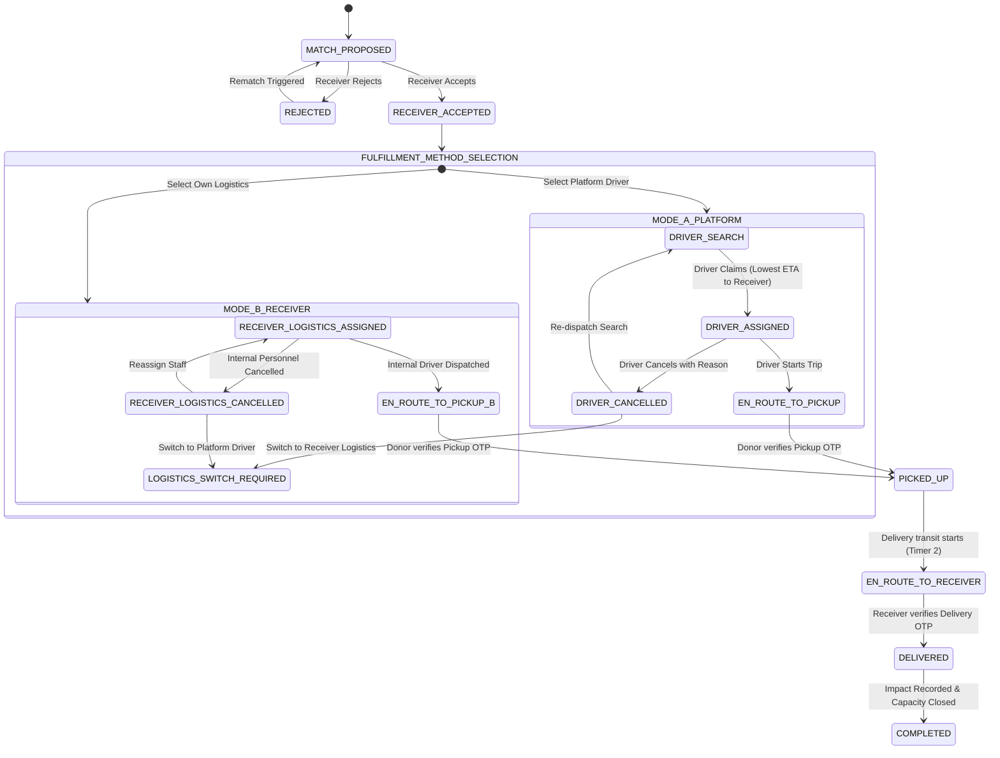

# PHASE 1: SYSTEM ARCHITECTURE SPECIFICATION
**Project**: EveryPlate (Real-Time Food Rescue Routing)  
**Version**: 1.0.0 (AmiHacks Hackathon)  
**Author**: Lead Product Architect & Senior Full-Stack Engineer

---

## 1. High-Level Architecture Overview

EveryPlate is architected around an event-driven, modular domain-centric architecture. Business logic is strictly decoupled from the presentation layer and organized into cohesive services with atomic boundary guarantees.

```
                          ┌────────────────────────────────────────────────────────┐
                          │                 CLIENT APPLICATION                      │
                          │   (React + Vite + TypeScript + Tailwind + Leaflet)      │
                          └──────┬──────────────────────┬───────────────────▲──────┘
                                 │ HTTP / REST          │ WebSocket (Events)│
                                 ▼                      ▼                   │
┌───────────────────────────────────────────────────────────────────────────┴──────┐
│                              BACKEND SERVER (Node.js + Express)                   │
├──────────────────────────────────────────────────────────────────────────────────┤
│ ┌──────────────────────────────────────────────────────────────────────────────┐ │
│ │                             API GATEWAY & AUTH                               │ │
│ │  - Role-Based Access Control (RBAC): DONOR, RECEIVER, DRIVER, ADMIN          │ │
│ │  - Privacy Filter & Address Masking Layer (Server-Side Enforced)             │ │
│ └───────────────────────┬──────────────────────────────────────────────────────┘ │
│                         │                                                        │
│ ┌───────────────────────▼──────────────────────────────────────────────────────┐ │
│ │                             CORE DOMAIN SERVICES                             │ │
│ │                                                                              │ │
│ │  ┌───────────────────────┐  ┌──────────────────────┐  ┌────────────────────┐ │ │
│ │  │    Donation Service   │  │   Matching Engine    │  │ Allocation Engine  │ │ │
│ │  │ - CRUD & Validation   │  │ - Stage 1: Filter    │  │ - 1:N Splitting    │ │ │
│ │  │ - Expiry Watcher      │  │ - Stage 2: Scoring   │  │ - Capacity Reserve │ │ │
│ │  └───────────────────────┘  └──────────────────────┘  └────────────────────┘ │ │
│ │                                                                              │ │
│ │  ┌───────────────────────┐  ┌──────────────────────┐  ┌────────────────────┐ │ │
│ │  │  Fulfillment Engine   │  │ OTP Verification Svc │  │   Impact Engine    │ │ │
│ │  │ - Mode A (Platform)   │  │ - Pickup OTP Token   │  │ - Actual Rescues   │ │ │
│ │  │ - Mode B (Receiver)   │  │ - Delivery OTP Token │  │ - CO2e & Weight    │ │ │
│ │  │ - Mode Switch Guard   │  │ - Custody Handoff    │  │ - Analytics Agg    │ │ │
│ │  └───────────────────────┘  └──────────────────────┘  └────────────────────┘ │ │
│ │                                                                              │ │
│ │  ┌───────────────────────┐  ┌──────────────────────┐  ┌────────────────────┐ │ │
│ │  │ Geospatial & Routing  │  │ Real-Time Event Bus  │  │ Notification Svc   │ │ │
│ │  │ - Haversine & ETA     │  │ - Socket.io Server   │  │ - In-App Alerts    │ │ │
│ │  │ - Multi-Driver Rank   │  │ - Room Subscriptions │  │ - Status Updates   │ │ │
│ │  └───────────────────────┘  └──────────────────────┘  └────────────────────┘ │ │
│ └──────────────────────────────────────┬───────────────────────────────────────┘ │
│                                        │                                         │
│ ┌──────────────────────────────────────▼───────────────────────────────────────┐ │
│ │                        PERSISTENCE & TRANSACTION LAYER                       │ │
│ │  - Prisma ORM / Relational Engine (SQLite in dev/hackathon, Postgres ready)  │ │
│ │  - Atomic Transactions ($transaction) for Capacity & Driver Assignment Lock  │ │
│ └─────────────────────────────────────────────────────────────────────────────┘ │
└──────────────────────────────────────────────────────────────────────────────────┘
```

---

## 2. Domain Entities & Bounded Contexts

### Context 1: Identity & Profiles (RBAC & Privacy)
* **User**: Base account (`id`, `email`, `role`, `name`, `createdAt`).
* **DonorProfile**: Donor-specific metadata (`userId`, `organizationName`, `donorType`, `latitude`, `longitude`, `address`, `phone`).
* **ReceiverProfile**: Receiver constraints (`userId`, `organizationName`, `maxCapacity`, `currentOccupancy`, `reservedIncomingQuantity`, `needLevel`, `foodPreferences` [JSON], `acceptingDonations`, `latitude`, `longitude`, `address`, `phone`, `hasOwnLogistics`).
* **DriverProfile**: Platform driver state (`userId`, `fullName`, `vehicleType`, `currentLatitude`, `currentLongitude`, `isAvailable`, `phone`).

### Context 2: Donations & Partial Allocations (1:N Domain Model)
* **Donation**: Root donation created by donor.
  * Fields: `id`, `donorId`, `foodCategory`, `description`, `quantity`, `unit`, `pickupLatitude`, `pickupLongitude`, `pickupAddress`, `availableAt`, `safeDeadline`, `imageUrl`, `notes`, `status` (`DRAFT`, `MATCHING`, `PARTIALLY_MATCHED`, `FULLY_MATCHED`, `FULFILLED`, `EXPIRED`, `CANCELLED`).
  * Invariant: A single donation is never duplicated when divided among receivers.
* **DonationAllocation**: Represents a slice of a donation designated for a specific receiver.
  * Fields: `id`, `donationId`, `receiverId`, `allocatedQuantity`, `status` (`PROPOSED`, `ACCEPTED`, `REJECTED`, `FULFILLING`, `COMPLETED`, `CANCELLED`).
* **CapacityReservation**: Tracks atomic holds on a receiver's available capacity.
  * `available_capacity = maxCapacity - currentOccupancy - reservedIncomingQuantity`.
  * Reservation created upon `DonationAllocation` creation / proposal. Released upon rejection or cancellation.

### Context 3: Fulfillment & Dual-Mode Logistics
* **Delivery**: Master delivery record bound to an allocation.
  * Fields: `id`, `allocationId`, `deliveryMode` (`PLATFORM_DRIVER` | `RECEIVER_LOGISTICS`), `status` (Finite State Machine), `pickupOtp`, `deliveryOtp`, `pickupVerifiedAt`, `deliveryVerifiedAt`.
* **DriverAssignment**: Platform driver assignment state.
  * Fields: `id`, `deliveryId`, `driverId`, `status` (`OFFERED`, `ACCEPTED`, `CANCELLED`, `COMPLETED`), `cancellationReason`.
* **ReceiverLogisticsAssignment**: Internal receiver logistics personnel tracking.
  * Fields: `id`, `deliveryId`, `driverName`, `vehicleInfo`, `contactMechanism`, `status` (`ASSIGNED`, `EN_ROUTE_PICKUP`, `PICKED_UP`, `EN_ROUTE_RECEIVER`, `DELIVERED`, `CANCELLED`).

### Context 4: Events, Verification & Analytics
* **DeliveryEvent**: Immutable audit trail for every status transition with timestamps and actor metadata.
* **ImpactRecord**: Derived impact figures produced strictly upon verified delivery completion.

---

## 3. Core Engine Workflows

### 3.1 Matching & Allocation Pipeline (Two-Stage Architecture)

```
[Donation Created / Triggered]
             │
             ▼
┌───────────────────────────────┐
│ STAGE 1: HARD ELIGIBILITY     │
│ - Food Category In Preferences│
│ - Receiver Accepting Donations│
│ - Available Capacity > 0      │
│ - Feasibility: Transit ETA <  │
│   (Safe Deadline - Now)       │
└──────────────┬────────────────┘
               │ (Eligible Candidate Receivers)
               ▼
┌───────────────────────────────┐
│ STAGE 2: MULTI-FACTOR SCORING │
│ Configurable Weights:         │
│ - Urgency Score (35%)         │
│ - Need Level Score (30%)      │
│ - Capacity Fit Score (20%)    │
│ - Distance / Travel Time (15%)│
└──────────────┬────────────────┘
               │ (Ranked Candidates)
               ▼
┌───────────────────────────────┐
│ ALLOCATION & SPLITTING ENGINE │
│ - Match full qty if capacity  │
│ - Split if capacity < qty:    │
│   Allocation A -> Receiver A  │
│   Remaining   -> Rematch      │
│ - Atomic Capacity Reservation │
└───────────────────────────────┘
```

#### Scoring Function Details:
* **Urgency Score ($S_{\text{urgency}}$)**:
  $$\tau = \frac{\text{safeDeadline} - \text{now}}{\text{safeDeadline} - \text{availableAt}}$$
  $$S_{\text{urgency}} = \max(0, \min(100, (1 - \tau) \times 100))$$
* **Need Level Score ($S_{\text{need}}$)**:
  - `HIGH`: 100
  - `MEDIUM`: 60
  - `LOW`: 25
* **Capacity Fit Score ($S_{\text{capacity}}$)**:
  Ratio of available capacity to required quantity, penalizing over-fragmentation:
  $$S_{\text{capacity}} = \min(100, \left(\frac{\text{availableCapacity}}{\text{requiredQuantity}}\right) \times 100)$$
* **Distance / Travel Time Score ($S_{\text{dist}}$)**:
  $$S_{\text{dist}} = \max(0, 100 - (\text{travelTimeMinutes} \times 2))$$
* **Composite Score**:
  $$\text{Score} = (0.35 \times S_{\text{urgency}}) + (0.30 \times S_{\text{need}}) + (0.20 \times S_{\text{capacity}}) + (0.15 \times S_{\text{dist}})$$

---

### 3.2 Dual Fulfillment State Machine



---

### 3.3 Simultaneous Driver Acceptance Dispatch Metric

As finalized in Phase 0:
* When a delivery is broadcast to the platform driver pool in `DRIVER_SEARCH` status:
* Multiple drivers may send `POST /api/deliveries/:id/accept` with their current GPS coordinates.
* **Dispatch Resolution Algorithm**:
  1. Acquire an atomic row-level lock or optimistic concurrency lock on `Delivery.id`.
  2. If status is already `DRIVER_ASSIGNED`, immediately return `409 Conflict` (Job already taken).
  3. If simultaneous batch window is active or evaluated: Compute $\text{ETA}_{\text{total}} = \text{ETA}(\text{driver} \to \text{donor}) + \text{ETA}(\text{donor} \to \text{receiver})$.
  4. The candidate with the **lowest total ETA to receiver** is granted the assignment.
  5. The delivery state transitions atomically to `DRIVER_ASSIGNED`.

---

### 3.4 Delivery Mode Switching Mechanics & Safety Re-validation

Receivers can toggle between `PLATFORM_DRIVER` and `RECEIVER_LOGISTICS` under specific trigger conditions:
1. **Trigger A (Platform Driver Unavailable or Cancelled)**: Driver pool yields no accepts within timeout or accepted driver cancels. Receiver clicks "Switch to Own Logistics".
2. **Trigger B (Internal Logistics Breakdown)**: Receiver's internal driver is unavailable. Receiver clicks "Request Platform Driver".
3. **Safety Re-validation Invariant**:
   - Check $(\text{safeDeadline} - \text{now}) > (\text{Estimated Pickup Time} + \text{Estimated Delivery Transit Time})$.
   - If time remaining is insufficient, mode switch is blocked and flagged as `CRITICAL_EXPIRY_RISK` / `DELIVERY_FAILED`.
   - Preserve capacity reservation and allocation integrity.

---

### 3.5 Privacy & Security Architecture

To guarantee strict compliance with Section 19 (Location Privacy) and Section 3:
* **Donor View**: Sees Receiver Organization Name and fulfillment status (`DRIVER_ASSIGNED`, `EN_ROUTE_PICKUP`, `PICKED_UP`). Does not see receiver physical street address or coordinator personal phone number.
* **Receiver View**: Sees Donor Restaurant Name, food details, driver name, vehicle info, and live transit status. Does not see donor private contact numbers.
* **Platform Driver View**: Receives exact donor pickup address and exact receiver delivery address **only after** delivery is in status `DRIVER_ASSIGNED` or later.
* **Receiver Personnel View**: Receives exact donor pickup address for pickup execution.
* **Server-Side Serialization**: DTO (Data Transfer Object) transformers filter out restricted fields based on authenticated user context.

---

### 3.6 Impact Metrics Calculation Pipeline

Impact records are created **exclusively** after verified `DELIVERY_OTP` handoff (`status = COMPLETED`):
* $\text{Meals Rescued} = \text{allocatedQuantity}$
* $\text{Weight Diverted (kg)} = \text{allocatedQuantity} \times 0.42\text{ kg}$
* $\text{Estimated CO}_2\text{e Avoided (kg)} = \text{Weight Diverted (kg)} \times 2.50\text{ kg CO}_2\text{e}$
* **Delivery Mode Metrics**: Count and timings separated by `PLATFORM_DRIVER` and `RECEIVER_LOGISTICS`.

---

## 4. Repository & Directory Structure

```
Annsafe/
├── backend/
│   ├── src/
│   │   ├── config/             # Config variables, scoring weights, env
│   │   ├── controllers/        # Express route handlers
│   │   ├── middleware/         # Auth, RBAC, error handling, privacy masking
│   │   ├── models/             # Prisma schema & database clients
│   │   ├── services/
│   │   │   ├── matching/       # Two-stage matching & multi-factor scoring
│   │   │   ├── allocation/     # 1:N splitting & atomic capacity reservation
│   │   │   ├── fulfillment/    # State machine (Platform & Receiver logistics)
│   │   │   ├── routing/        # Geodesic, ETA & driver dispatch calculations
│   │   │   ├── otp/            # Cryptographic OTP generation & verification
│   │   │   ├── impact/         # Impact calculation & aggregation
│   │   │   └── socket/         # Socket.io real-time event publisher
│   │   ├── routes/             # REST API route definitions
│   │   ├── types/              # TypeScript domain types & interfaces
│   │   └── app.ts              # Express app & HTTP/Socket server setup
│   ├── prisma/
│   │   └── schema.prisma       # Database schema
│   ├── package.json
│   └── tsconfig.json
├── frontend/
│   ├── src/
│   │   ├── components/         # Reusable UI widgets, badges, modal, countdown
│   │   ├── features/
│   │   │   ├── donor/          # Donor portal: Create donation, track handoffs
│   │   │   ├── receiver/       # Receiver portal: Accept/reject, fulfillment pick
│   │   │   ├── driver/         # Driver portal: Job board, accept, route, OTP
│   │   │   └── admin/          # Admin portal: Command center, live map, impact
│   │   ├── hooks/              # Real-time WebSocket hooks, auth hooks
│   │   ├── services/           # Axios/Fetch API client
│   │   ├── types/              # Shared frontend models
│   │   └── App.tsx             # Root router & role switcher
│   ├── package.json
│   └── vite.config.ts
└── docs/                       # Architectural specs & phase handoffs
```
